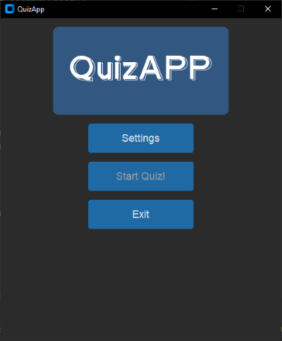
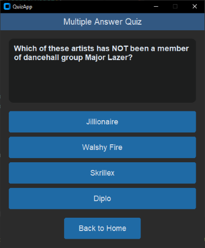

# QuizAPP
This is a simple graphical user interface (GUI) implementation of a quiz game, using [OpenTrivia data base](https://opentdb.com/).

## Requirements
To run the code, the following packages are required:
- [Customtkinter](https://pypi.org/project/customtkinter/)
- [Pillow](https://pypi.org/project/pillow/)

## ScreenShots

